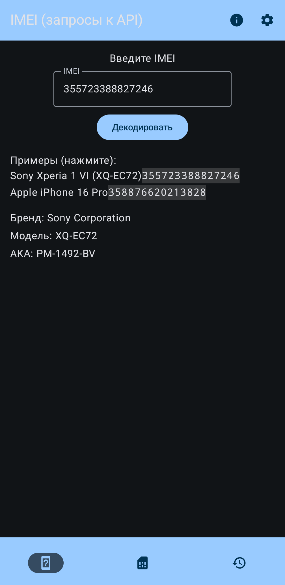
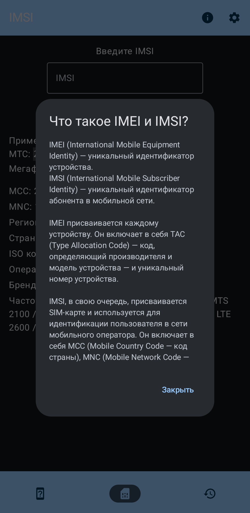
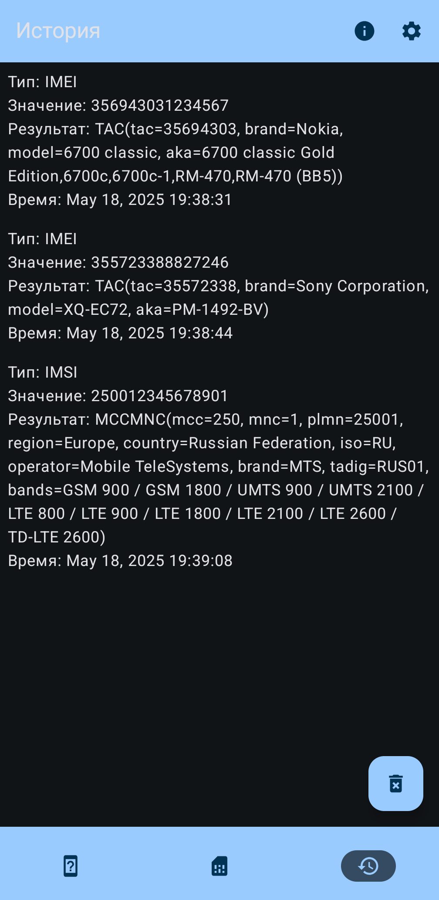
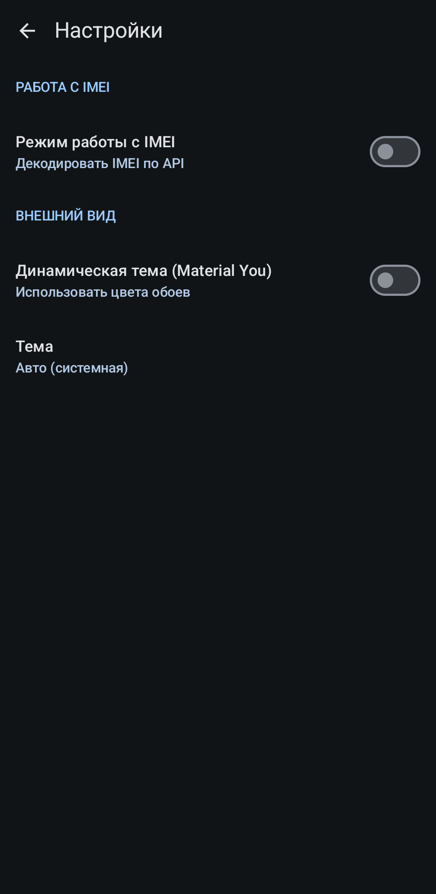

# IMEI & IMSI Decoder 

## [[RU](./README.md)] ● [EN]

## A native Android application for decoding IMEI and IMSI

[](https://www.gnu.org/licenses/agpl-3.0.html)

[](https://apps.obtainium.imranr.dev/redirect?r=obtainium://app/%7B%22id%22%3A%22com.tenshi18.imeiimsidecoder%22%2C%22url%22%3A%22https%3A%2F%2Fcodeberg.org%2FTenshi18%2FIMEI-IMSI-decoder%22%2C%22author%22%3A%22Tenshi18%22%2C%22name%22%3A%22IMEI%20%26%20IMSI%20decoder%22%2C%22preferredApkIndex%22%3A0%2C%22additionalSettings%22%3A%22%7B%5C%22includePrereleases%5C%22%3Afalse%2C%5C%22fallbackToOlderReleases%5C%22%3Atrue%2C%5C%22filterReleaseTitlesByRegEx%5C%22%3A%5C%22%5C%22%2C%5C%22filterReleaseNotesByRegEx%5C%22%3A%5C%22%5C%22%2C%5C%22verifyLatestTag%5C%22%3Afalse%2C%5C%22sortMethodChoice%5C%22%3A%5C%22date%5C%22%2C%5C%22useLatestAssetDateAsReleaseDate%5C%22%3Afalse%2C%5C%22releaseTitleAsVersion%5C%22%3Afalse%2C%5C%22trackOnly%5C%22%3Afalse%2C%5C%22versionExtractionRegEx%5C%22%3A%5C%22%5C%22%2C%5C%22matchGroupToUse%5C%22%3A%5C%22%5C%22%2C%5C%22versionDetection%5C%22%3Atrue%2C%5C%22useVersionCodeAsOSVersion%5C%22%3Afalse%2C%5C%22apkFilterRegEx%5C%22%3A%5C%22%5C%22%2C%5C%22invertAPKFilter%5C%22%3Afalse%2C%5C%22autoApkFilterByArch%5C%22%3Atrue%2C%5C%22appName%5C%22%3A%5C%22%5C%22%2C%5C%22appAuthor%5C%22%3A%5C%22%5C%22%2C%5C%22shizukuPretendToBeGooglePlay%5C%22%3Afalse%2C%5C%22allowInsecure%5C%22%3Afalse%2C%5C%22exemptFromBackgroundUpdates%5C%22%3Afalse%2C%5C%22skipUpdateNotifications%5C%22%3Afalse%2C%5C%22about%5C%22%3A%5C%22%5C%22%2C%5C%22refreshBeforeDownload%5C%22%3Afalse%7D%22%2C%22overrideSource%22%3Anull%7D)
[](https://codeberg.org/Tenshi18/IMEI-IMSI-decoder/releases/latest)
[](https://github.com/Tenshi18/IMEI-IMSI-decoder/releases)

## App Interface
<p align="left">
   
   
   
   
</p>

## Screens
- IMEI decoding: obtaining the device's manufacturer and model information.
- IMSI decoding: obtaining the region and mobile carrier information.
- Query history with a floating action button to clear it.
- Settings: system, dark and light themes, toggle for Material You dynamic colors.

## Stack
- **Jetpack Compose** for UI.
- **DataStore** for storing settings and history.
- **Room** for querying offline TAC and MCC/MNC databases.
- **Moshi** for parsing and serializing JSON data.

## Building from Source
1. Clone the repository:
   ```bash
   git clone https://codeberg.org/Tenshi18/IMEI-IMSI-decoder.git
   ```
   or
   
   ```bash
   git clone https://github.com/Tenshi18/IMEI-IMSI-decoder.git
   ```
2. Open the project in Android Studio.
3. Sync the project and build the AAB/APK using "Build" -> "Generate App Bundles or APKs"/"Generate Signed App Bundle/APK...".

## Database Sources
- TAC (IMEI): http://tacdb.osmocom.org/ (CC-BY-SA v3.0)
- MCC/MNC (IMSI): https://mcc-mnc.net/ (MIT Open Source license)

## Coming Soon
- [x] Option to decode IMEI via API (network requests to https://alpha.imeicheck.com/api/ with the latest TAC database) and switch between local DB/API.
- [ ] Adapt IMSI decoding for 3-digit MNCs.
- [ ] Improved input validation: show an error immediately if IMEI/IMSI is of invalid length or contains invalid characters.
- [ ] Cache network requests.
- [ ] Optimize database queries (DAO).
- [ ] Export/import query history (JSON/CSV) for backups.
- [ ] "Copy to clipboard" option directly from the results screen.
- [ ] Multilingual UI (Russian and English) instead of hardcoded strings.
- [ ] Pure Black theme toggle in app's appearance settings.
- [ ] Smooth animations for transitions between screens.
