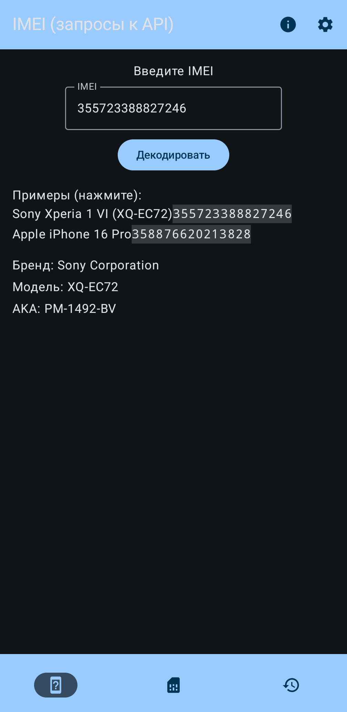
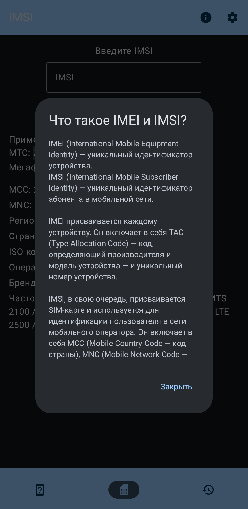

# IMEI & IMSI Decoder 

## [RU] ● [[EN](./README-en.md)]

## Нативное Android-приложение для декодирования IMEI и IMSI

[](https://www.gnu.org/licenses/agpl-3.0.html)

[](https://apps.obtainium.imranr.dev/redirect?r=obtainium://app/%7B%22id%22%3A%22com.tenshi18.imeiimsidecoder%22%2C%22url%22%3A%22https%3A%2F%2Fcodeberg.org%2FTenshi18%2FIMEI-IMSI-decoder%22%2C%22author%22%3A%22Tenshi18%22%2C%22name%22%3A%22IMEI%20%26%20IMSI%20decoder%22%2C%22preferredApkIndex%22%3A0%2C%22additionalSettings%22%3A%22%7B%5C%22includePrereleases%5C%22%3Afalse%2C%5C%22fallbackToOlderReleases%5C%22%3Atrue%2C%5C%22filterReleaseTitlesByRegEx%5C%22%3A%5C%22%5C%22%2C%5C%22filterReleaseNotesByRegEx%5C%22%3A%5C%22%5C%22%2C%5C%22verifyLatestTag%5C%22%3Afalse%2C%5C%22sortMethodChoice%5C%22%3A%5C%22date%5C%22%2C%5C%22useLatestAssetDateAsReleaseDate%5C%22%3Afalse%2C%5C%22releaseTitleAsVersion%5C%22%3Afalse%2C%5C%22trackOnly%5C%22%3Afalse%2C%5C%22versionExtractionRegEx%5C%22%3A%5C%22%5C%22%2C%5C%22matchGroupToUse%5C%22%3A%5C%22%5C%22%2C%5C%22versionDetection%5C%22%3Atrue%2C%5C%22useVersionCodeAsOSVersion%5C%22%3Afalse%2C%5C%22apkFilterRegEx%5C%22%3A%5C%22%5C%22%2C%5C%22invertAPKFilter%5C%22%3Afalse%2C%5C%22autoApkFilterByArch%5C%22%3Atrue%2C%5C%22appName%5C%22%3A%5C%22%5C%22%2C%5C%22appAuthor%5C%22%3A%5C%22%5C%22%2C%5C%22shizukuPretendToBeGooglePlay%5C%22%3Afalse%2C%5C%22allowInsecure%5C%22%3Afalse%2C%5C%22exemptFromBackgroundUpdates%5C%22%3Afalse%2C%5C%22skipUpdateNotifications%5C%22%3Afalse%2C%5C%22about%5C%22%3A%5C%22%5C%22%2C%5C%22refreshBeforeDownload%5C%22%3Afalse%7D%22%2C%22overrideSource%22%3Anull%7D)
[](https://codeberg.org/Tenshi18/IMEI-IMSI-decoder/releases/latest)
[](https://github.com/Tenshi18/IMEI-IMSI-decoder/releases)

## Интерфейс приложения
<p align="left">
   
   
   
   
</p>

## Экраны
- Декодирование IMEI: получение производителя и модели устройства.
- Декодирование IMSI: получение региона и оператора сотовой связи.
- История запросов с возможностью её очистки.
- Настройки: системная, тёмная и светлая темы, переключение динамических цветов Material You.

## Используемые технологии
- **Jetpack Compose** для UI.
- **DataStore** для хранения настроек и истории.
- **Room** для запросов к оффлайн базам TAC и MCC/MNC.
- **Moshi** для парсинга и сериализации JSON-данных.

## Сборка из исходного кода
1. Клонируйте репозиторий:
   ```bash
   git clone https://codeberg.org/Tenshi18/IMEI-IMSI-decoder.git
   ```
   или
   
   ```bash
   git clone https://github.com/Tenshi18/IMEI-IMSI-decoder.git
   ```
2. Откройте проект в Android Studio.
3. Синхронизируйте проект, соберите AAB/APK с помощью "Build" -> "Generate App Bundles or APKs"/"Generate Signed App Bundle/APK...".

## Источники БД
- TAC (IMEI): http://tacdb.osmocom.org/ (CC-BY-SA v3.0)
- MCC/MNC (IMSI): https://mcc-mnc.net/ (MIT Open Source license)

## Скоро будет реализовано
- [x] Возможность декодировать IMEI по API (сетевые запросы к https://alpha.imeicheck.com/api/ с актуальной базой TAC) и переключать режим работы (локальная БД/API).
- [x] Адаптация декодирования IMSI под трёхзначные MNC.
- [x] Кэширование сетевых запросов.
- [x] Оптимизация запросов к базе данных (DAO).
- [x] Кнопка "Копировать в буфер обмена" прямо из экрана результатов.
- [ ] Экспорт/импорт истории запросов (JSON/CSV) для резервного копирования.
- [ ] Мультиязычный интерфейс (русский и английский) вместо hardcoded строк.
- [ ] Переключатель чёрной темы (Pure Black) в настройках внешнего вида приложения.
- [ ] Плавные анимации переходов между экранами.
